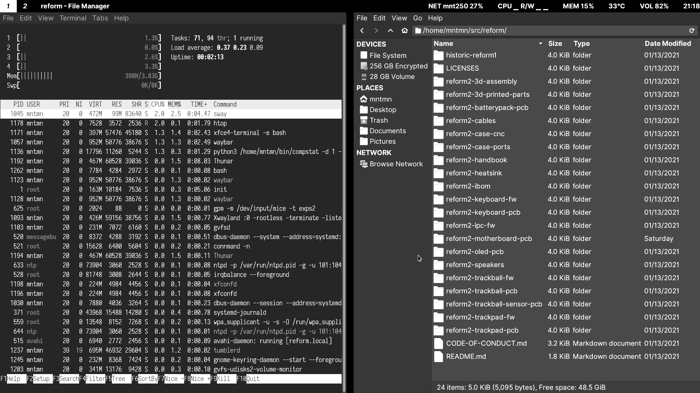
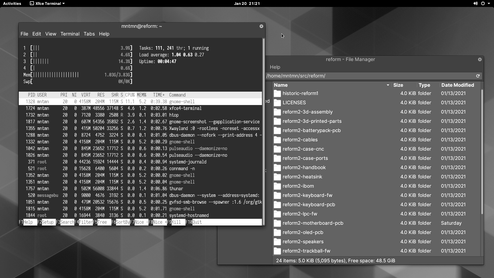

Graphical Desktops
==================

MNT Reform ships with two graphical environments ("desktops") on the SD card. The Debian distribution, which the system on the SD card is based on, has a number of additional desktops in its package manager (See "Install/Remove Software").

1. The **Sway** compositor emphasizes the concept of "tiling". This means that normally, windows don't overlap, but instead the screen space is automatically divided to make space for new windows. Sway consumes minimal system resources, but relies heavily on keyboard shortcuts, which makes it harder to learn.

2. The **GNOME** desktop features classic overlapping windows and a modern look. It is easy to learn and use by mouse / trackball / trackpad pointing and clicking, but requires more system resources.

Sway Basics
-----------

You can start sway from the command line by executing the ``sway`` command:

.. code-block:: none

 sway

From now on, you can start a new terminal window by holding down the *SUPER* [#]_ key and pressing the *ENTER* key once (*SUPER+ENTER*).

.. [#] *SUPER* is the key with the MNT Research logo next to the *HYPER* key.

Tiling
++++++

When you press *SUPER+ENTER* multiple times to open several terminals, you'll notice that your currently open windows will be resized to accomodate for the new window. You can switch between these windows by holding the *SUPER* key and pressing the cursor (arrow) keys in the desired direction.

If you keep adding windows, they will continuously shrink horizontally, but if you would rather have a window split vertically, you can. Use these shortcuts for deciding:

========= =========================
*SUPER+H* Split window horizontally
*SUPER+V* Split window vertically
========= =========================

Note that the window is not split instantaneously. You're just telling Sway "The next time I create a window, put it below/beside my current window."

You may also use *SUPER+W* to tell Sway to use tabs. You can switch your tab using the same shortcuts for switching between windows.

You can use *SUPER+ESC* to close the currently selected window.

Workspaces
++++++++++

You can change your active workspace with the number keys, for example:

=============== =================================
*SUPER+2*       Go to workspace 2
*SUPER+1*       Go back to workspace 1
*SUPER+SHIFT+5* Move active window to workspace 5
=============== =================================

You can open different spaces for different programs. For example, you might want to put your code-editing programs in workspace 1, a web browser in workspace 2, and some instant messaging programs in workspace 3.

Launching Applications
++++++++++++++++++++++

Reform's sway configuration includes "rofi", a popup menu for launching an application by typing a part of its name. Press *SUPER+D* to open the menu. Over time, rofi will remember the applications you regularly launch and list them in the initial menu.

Waybar
++++++

On MNT Reform, Sway comes with an information bar at the top of the screen called "Waybar". On the left hand side, Waybar shows the active workspaces as tabs. Instead of using keyboard combinations, you can click on a tab to activate the corresponding workspace. Next to the workspaces, Waybar shows the title of the window that is currently in focus.

On the right hand side, Waybar shows the following information (in this order):

=============== =========================================
Field           Action on Click
=============== =========================================
Network         Network Configuration (``connman-gtk``)
CPU/Disk        System Monitor (``gnome-system-monitor``)
Memory Usage    ---
CPU Temperature ---
Volume          Volume Control (``pavucontrol``)
Battery Gauge   ---
Clock           Toggles between time and date
=============== =========================================

Display Brightness
++++++++++++++++++

You can set the display's brightness using the ``brightnessctl`` command or, more conveniently, use one of these keyboard shortcuts:

========== ===========================
*SUPER+F1* Decrease display brightness
*SUPER+F2* Increase display brightness
========== ===========================

Config File
+++++++++++

You can tailor Sway's behaviour and keyboard shortcuts by editing the file ``~/.config/sway/config``.

All configuration options are documented in the Sway Wiki: `<https://github.com/swaywm/sway/wiki>`_.

GNOME Basics
------------

Launch the GNOME desktop from the Linux console by typing:

.. code-block:: none

 gnome-session

After a while, the label "Activities" will appear in the top-left corner of the screen. Click this label to reveal the Activities overview. Alternatively, you can press the *SUPER* key to open this overview. From here, you can launch applications by typing (a part of) their name. You can drag and drop applications that you commonly use into the "dock" on the left. Applications that are already running are displayed in the dock, too. Clicking on them will bring them to the foreground.

GNOME supports a range of keyboard shortcuts to speed up working with the desktop:

================= ===========================
*SUPER*           Open Activities
*SUPER+TAB*       Go to next window
*SUPER+SHIFT+TAB* Go to previous window
*CTRL+ALT+T*      Launch a terminal
*SUPER+PGUP*      Workspace above
*SUPER+PGDN*      Workspace below
================= ===========================

GNOME displays system status icons in the top-right corner of the screen. You can click these icons to access network configuration, see the battery status and log out or shut down the computer.
