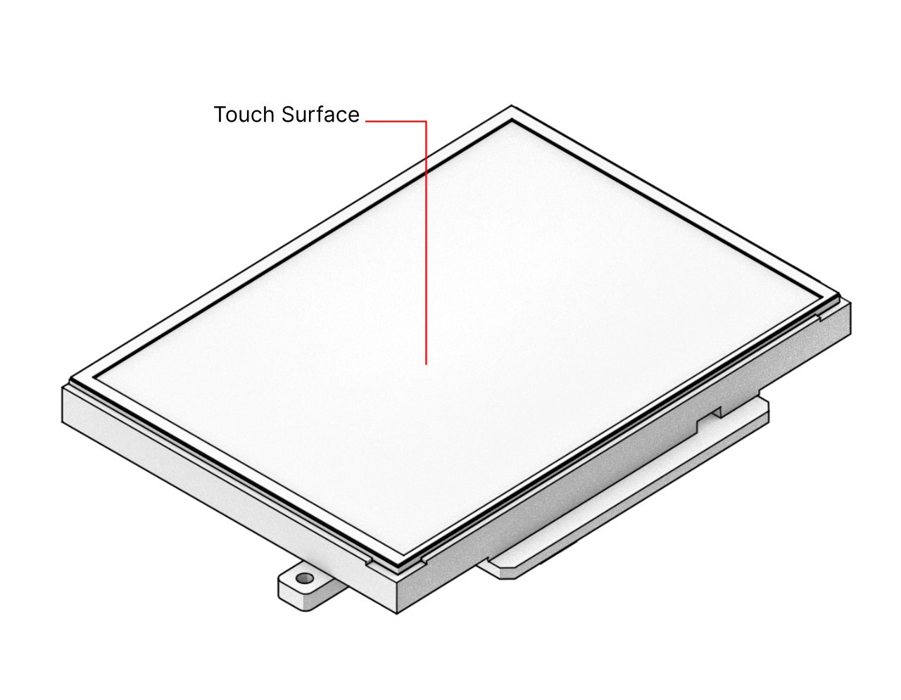

Input Devices
=============

MNT Reform comes with a keyboard and either a trackball or a trackpad preinstalled. All of the input devices are modular and can be easily swapped in and out. They all connect via internal USB 2.0 cables.

Keyboard
--------
.. image:: _static/illustrations/5b-callouts.png

The layout of the MNT Reform keyboard is slightly unusual. We simplified the traditional typewriter-based layout so that the keyboard can be constructed using only two distinct key shapes (square and 1.5x). This removes the need for mechanical stabilizers for long keys and makes it easier to customize and swap keycaps to your liking.

The biggest difference is the split spacebar: instead of one long key, there are two 1.5x wide space keys, with left and right Alt keys sandwiched between them. Because many advanced users remap the traditional Caps Lock key to a different function, we swapped Caps Lock for a Ctrl key.

This makes the use of Ctrl key combinations more ergonomic. Next to the Ctrl key is a key with 3 dots (an ellipsis). This is normally the Menu key, but on the default MNT Reform system software, it is mapped to Compose (a key that allows you to generate Unicode symbols from Compose sequences). Lastly, MNT Reform features an additional modifier key, the Hyper key, in the lower left. The idea is to let you assign this key to whatever function you require.

OLED Menu
---------

The keyboard has a built-in OLED display for interaction with the System Controller on the motherboard. You can highlight an option and scroll through the menu by using the **↑** and **↓** keys. To trigger the highlighted option, press **Enter**. Alternatively, you can press the shortcut key that is displayed on the right hand side of each menu option. For example, to show the Battery Status, press **B** when the menu is active. To leave the menu, press **ESC**.

You can see detailed battery information including the estimated total charge percentage on the Battery Status screen reachable through the OLED menu. Each cell icon corresponds to one of the eight battery cells. The leftmost group of four icons represent the battery pack on the left side of the device, and the top icon in each group represents the leftmost cell in each pack---assuming you look at MNT Reform when flipped on its back and the battery closer towards you.

Trackball
---------

The trackball works like a three-button mouse. Rolling the ball will move the cursor in the same direction. In addition to the standard three mouse buttons (left, middle, right), the trackball also has two *Wheel Mode* buttons. Holding down either while moving the ball up and down will scroll the currently focused content.

Trackpad
--------

The trackpad senses the touch of your fingers. Unlike the trackball, it does not have any moving parts or buttons. Slide one finger across to move the cursor. Tapping with one finger acts like a left mouse button click. Sliding two fingers vertically allows you to scroll (like a mouse wheel). Tapping with two fingers performs a right click. To click and drag, i.e. to select text or drag and drop icons, use three fingers. Tapping three fingers is equivalent to a middle click.
