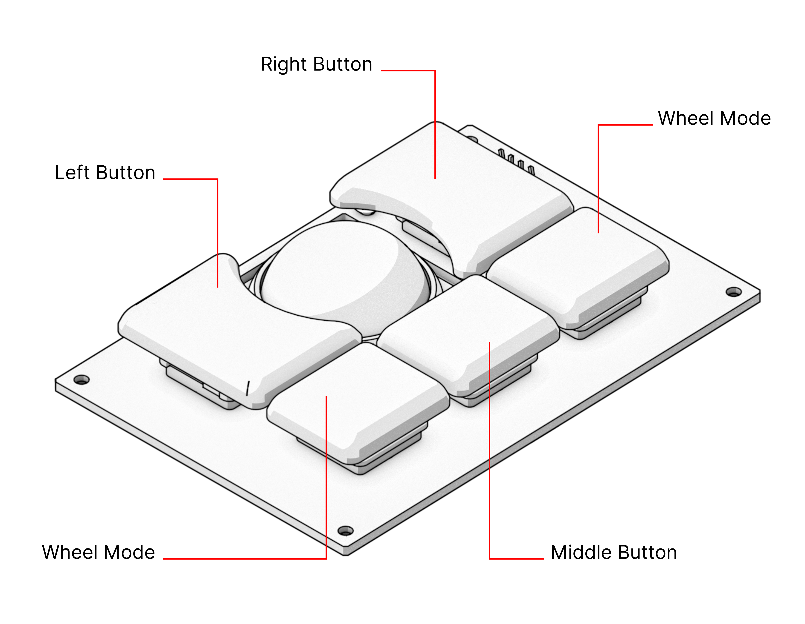

Input Devices
=============

Keyboard
--------

TODO explain the rationale behind the layout.

TODO explain the modifier keys.

Trackball
---------

The trackball works similar to a three-button mouse. Rolling the ball will push the cursor in the same direction. In addition to the standard three mouse buttons, the trackball also has two "Wheel Mode" buttons. Holding down either while moving the ball will scroll the currently focused content.

Trackpad
--------

TODO explain gestures.
