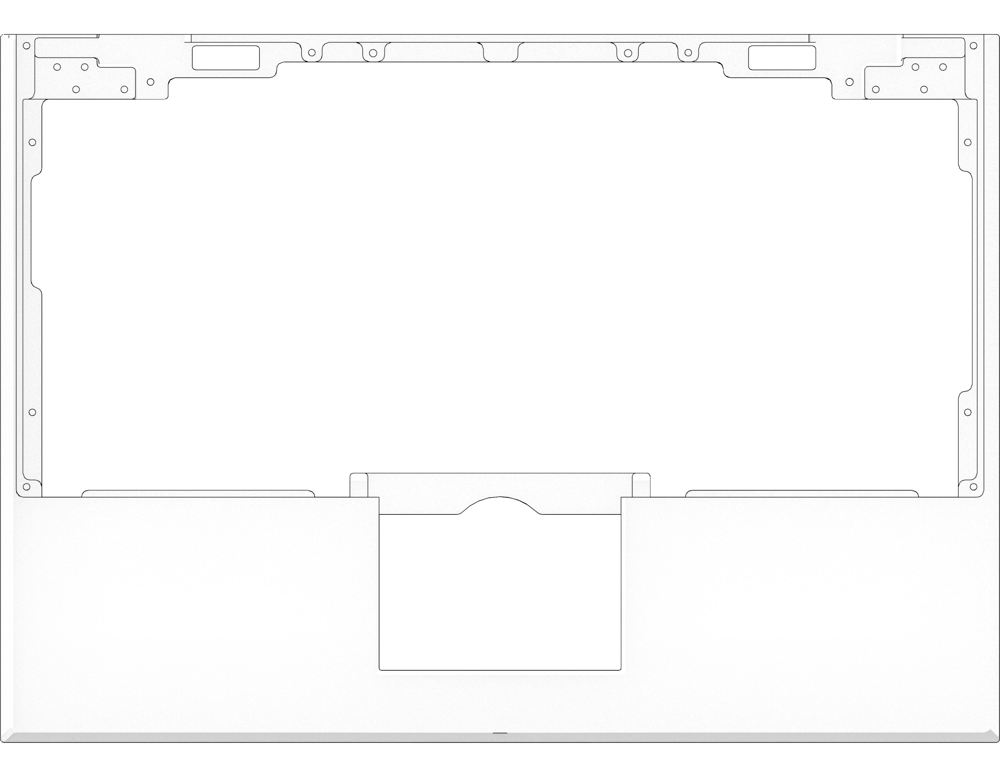
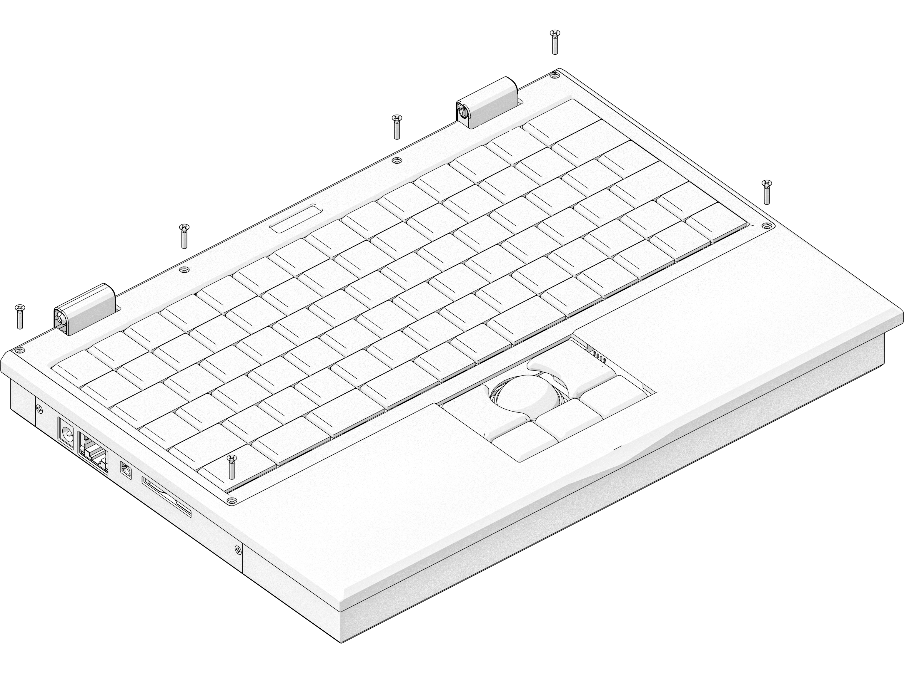
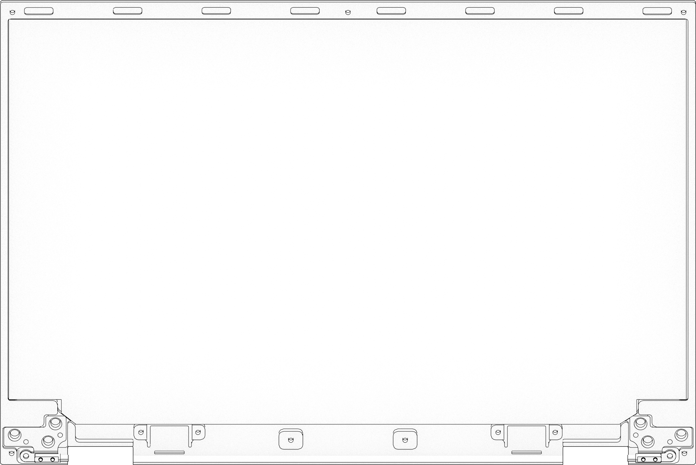
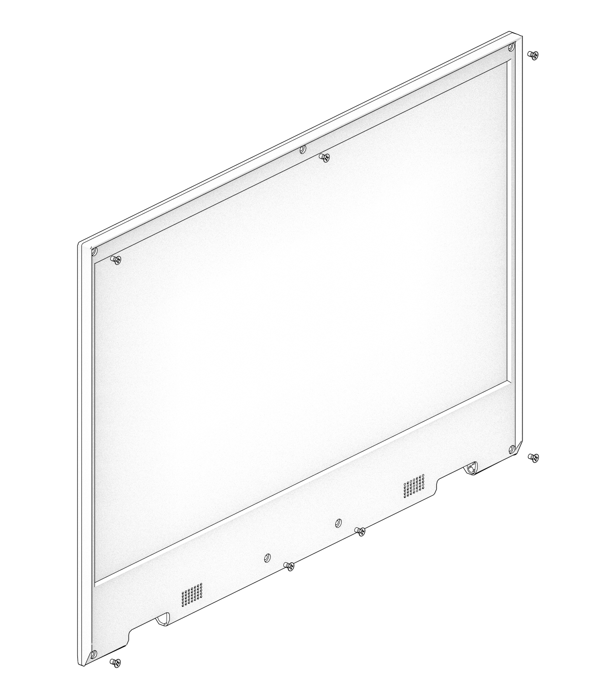
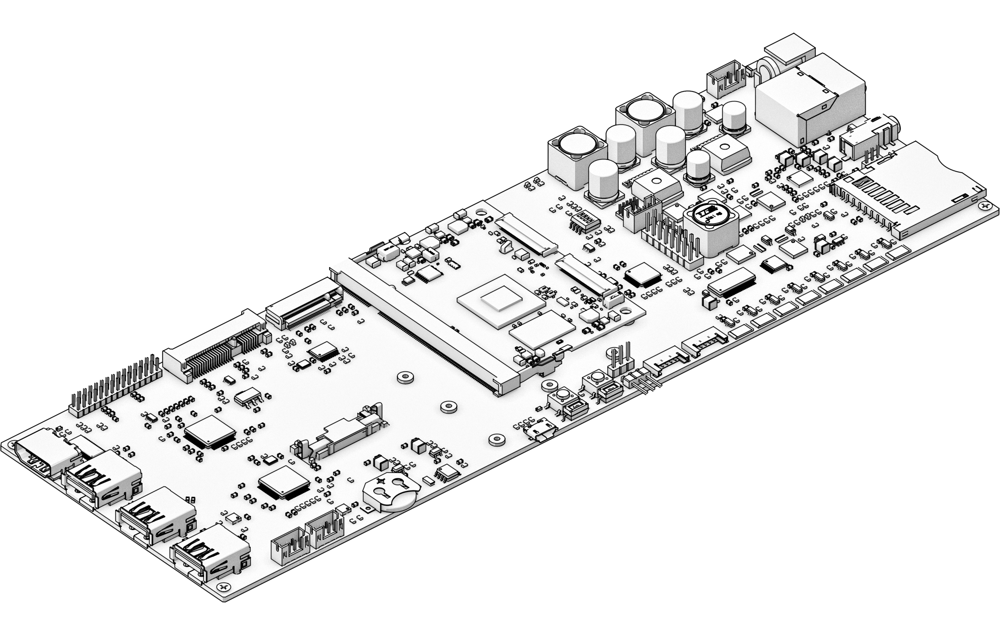
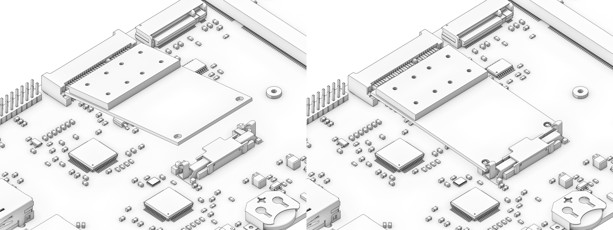
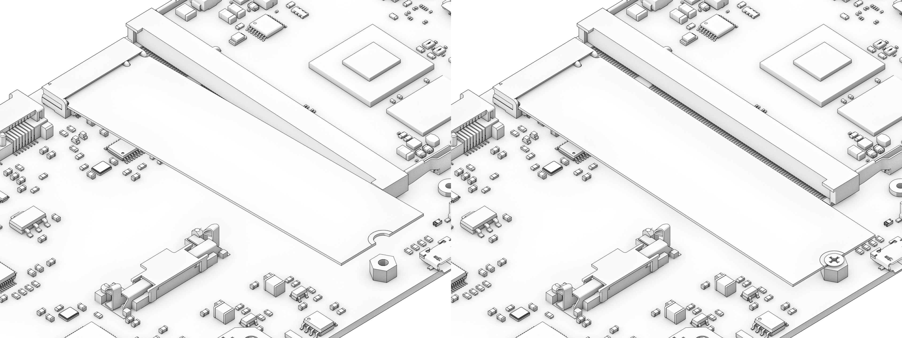
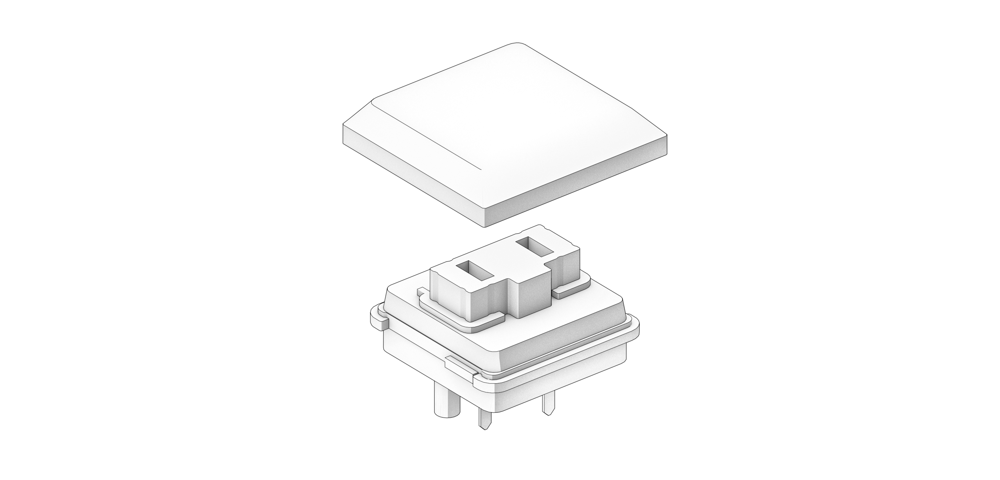
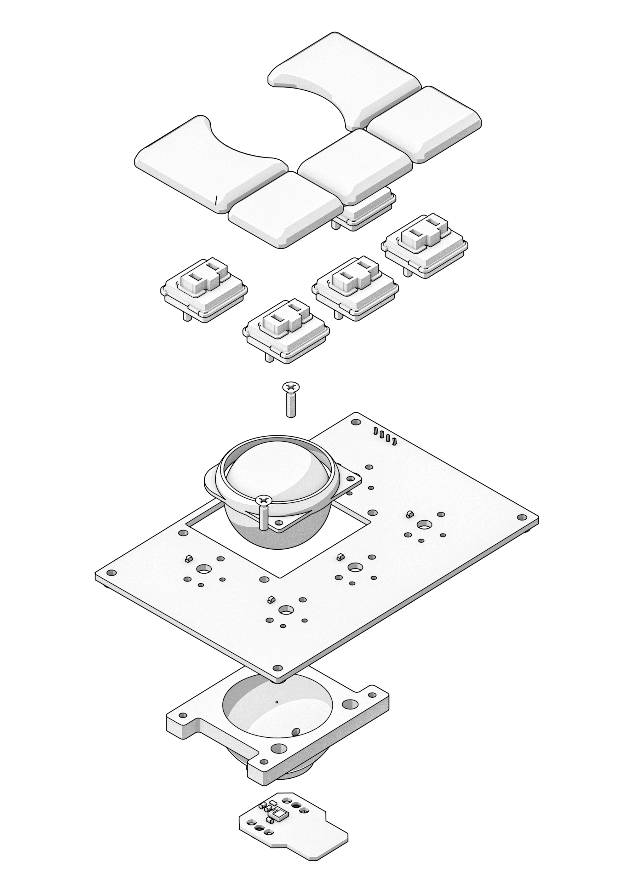
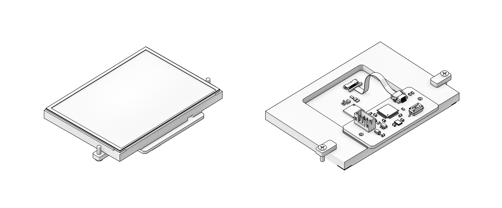

Parts and Schematics
++++++++++++++++++++

.. role:: raw-latex(raw)
   :format: latex

Case Parts
==========

The case consists of the following 5 parts. All parts except the bottom plate are milled from sand-blasted and anodized 6061 aluminum.

1. **Main Box:** the chassis of MNT Reform. All PCBs (printed circuit boards) are attached to it via screws: The keyboard from the top and motherboard, trackball/trackpad, and battery boards from the bottom. The lower half of the hinges and the system controller OLED PCB are mounted from the top as well.
2. **Keyboard Frame:** a thin rectangle that covers the sides of the keyboard and the system controller OLED
3. **Screen Back:** housing the display and upper half of hinges
4. **Screen Front:** housing speakers and providing display bezel
5. **Bottom Plate:** the clear acrylic bottom lid

For easy (dis)assembly, Reform uses only M2 screws with Phillips-head everywhere -- with one exception: M4x5 on the top half of the hinges.

When closed, the case is held shut by four neodymium bar magnets which are located in the front edge of the screen enclosure and another four in the front of the main box (8 in total).

Main Box
--------

The main box houses most of the electronics:

- Motherboard, exposing ports through openings on the left and right
- Two LiFePO4 battery packs, connecting to motherboard via Molex PicoLock cables
- Keyboard, connecting to the motherboard via two JST-PH cables
- OLED display, connecting to the keyboard via a 4-pin 1mm pitch flex cable
- Trackball or Trackpad, connecting to motherboard via one JST-PH cable

The main box features four neodymium bar magnets inserted into slots below the front edge. These match with their counterparts in the screen front.

Keyboard Frame
--------------

The Keyboard Frame is inserted into the main box to close it from the top. It has four protruding ledges on the front that go first. The frame is mounted with six M2x6 flathead screws.

Screen Back
-----------

The eDP display panel rests in this case part. The left and right hinges are mounted in the bottom left and right corners with three M4x5 flathead screws each.

.. image:: _static/illustrations/speaker.png

The stereo speakers are mounted below the display and secured with the speaker holders. Each holder is mounted with two M2x4 flathead screws.

Both speaker and display cable are fed through a hollow part in the hinge and into the main box.

Four neodymium magnets are mounted along the top edge. These, together with their counterparts in the main box, hold the laptop shut when closed.

Screen Front
------------

This part serves as a bezel for the display. It is mounted with seven M2x6 flathead screws to the Screen Back.

Bottom Plate
------------

.. image:: _static/illustrations/33t.png

The bottom plate closes the main box from the bottom with ten M2x6 flathead screws.

Motherboard
===========

TODO: callouts of important parts and connectors.

The motherboard spans the complete inner width of the device (around 27 cm) and ends with external ports on both sides. It has the following features:

TODO: rewrite this list

- **Power system:** includes a charger for LiFePO4 cells and seamlessly switches between wall and battery power.
- **System controller:** coupled to the power system, an NXP LPC11U24 Cortex-M0 MCU controls an analog monitor chip for the eight battery cells as well as the charger. It is connected to the SoM via SPI, and has GPIO lines to the main power rail switchers in the system. It has a UART (serial port) that the keyboard can talk to directly for issuing power on/off commands and battery status queries.
- **DSI to eDP converter:** it was an important goal for us to make the main display path for Reform blob-free, so we couldn't use the existing HDMI/DisplayPort block in i.MX8M to drive the internal display, because this needs a chunk of firmware related to content protection. Instead, we're using the MIPI DSI output and convert its signal to eDP using a Texas Instruments SN65DSI86 chip. All involved drivers are open and in mainline Linux.
- **USB 3.0 hub:** i.MX8M has 2x USB 3.0 controllers. As we need two internal USB ports for the keyboard and trackball (or trackpad) and wanted to provide three external USB ports, we put a Texas Instruments TUSB8041 USB hub chip on the board that provides the extra ports. We have USB load switches on each external port to protect from too much current draw.
- **Sound system:** the Reform motherboard features a Wolfson/Cirrus WM8960 audio DAC (digital-to-analog converter)/amplifier interfacing to the headphone/microphone jack and powering two speakers housed below the main display.
- **mPCIe slot:** the other PCIe controller drives an mPCIe connector that you can use for expansions like a Wi-Fi card (included in the Reform Max pledge level), an embedded graphics card or an FPGA board, for example.
- **M.2 slot:** we put one M.2 M-key slot on the board that can house an NVMe SSD.

System Controller
-----------------

Independent from the main processor module, a low-power processor sits on MNT Reform's motherboard. The NXP LPC11U24 is a 32-bit ARM Cortex-M0 CPU that uses very little power and is always on as long as there is battery or wall power in the system. We call this processor the System Controller.

The System Controller runs a bare metal program in an endless loop that has the following jobs:

- Powering the individual voltage rails of the system on and off (including the main processor's power and the mPCIe slot's power, to implement a WiFi-killswitch, for example)
- Hard resetting the main processor
- Monitoring the voltage of each battery cell
- Balancing battery cells. If a cell is overvolted, charging is halted and the overvolted cells are discharged until they are back to a nominal voltage
- Turning off the system if battery cells are undervolted
- Reporting total current flowing in and out of the batteries
- Turning charge current on or off

Your main way of talking to the System Controller is with the Keyboard. The Keyboard has, aside from its USB connection to the main processor, a second serial (UART) connection/cable to the motherboard's SYSCTL port. A 57600 bps connection is always established between the Keyboard and the System Controller.

It accepts commands in the form of a single letter followed by return. A command can also be prefixed with a single argument, a positive integer of up to 4 digits. The most important commands are:

- *1p*: Turn the computer on
- *0p*: Turn the computer off
- *a*: Get current flowing into/out of batteries in mA
- *0v*: Get voltage of cell 0 (cells are numbered 0-7)
- *V*: Get system voltage at point of combined battery input/output
- *s*: Get System Controller state (a message string)
- *g*: Get estimated "fuel gauge" of batteries (percentage)

The individual cell voltages are measured by the Battery Monitor LTC6803IG-4#PBF and reported via SPI to the System Controller.

The total voltage and current are measured by the INA260 chip and reported via I2C to the System Controller.

To understand the available commands in more detail, you can take a look at the System Controller's ``handle_commands()`` function.

TODO: Side note:
The System Controller is permanently connected to the main processor's UART2 (/dev/ttymxc1 in Linux). If you want to interrupt this connection for security reasons, you can desolder resistors R48 and R50.

You can monitor the raw output of the System Controller going to the keyboard by connecting a terminal such as GNU Screen to the internal serial port UART2:

.. code-block:: none

   screen /dev/ttymxc1 57600

Flashing the Firmware
---------------------

.. image:: _static/illustrations/27t.png

TODO: callouts for micro-usb and switches
You can find the source code of the firmware_ in the folder "reform2-lpc-fw" of the Reform source repository.

To flash the firmware of the System Controller, you need another computer and a Micro-USB cable.

1. Set DIP switch LPCPROG to "ON"
2. Press button LPCRESET
3. Connect Micro-USB cable
4. System Controller's memory appears as virtual flash drive on secondary computer
5. Execute `flash.sh` and provide path to virtual flash drive
   TODO: Programming task: automatically find correct drive in flash script
6. Unplug cable
7. Set DIP switch LPCPROG to "OFF"
8. Press button LPCRESET

.. _firmware: https://source.mntmn.com/MNT/reform/reform2-lpc-fw
.. _handle_commands: https://source.mntmn.com/MNT/reform/reform2-lpc-fw/src/boards/reform2.c

Expansion Port
--------------

.. image:: _static/illustrations/28t.png

TODO: annotate expansion port and LPC
The Expansion Port U18, labelled "Hack the Planet" is meant for advanced users that want to connect sensors or other peripherals to MNT Reform's system controller. Please note that changing the system controller's program can disrupt the battery charging control loop, potentially causing over- or undercharged cells, resulting in physical damage and/or injury. **Experiment with the system controller only if you know exactly what you're doing and at your own risk.**

The Expansion Port features an SPI interface, two analog-digital converters, a UART, JTAG and 3.3V Power. All non-power pins can alternatively be used as GPIOs.

The following pins are available at the port:

=== ==========
Pin Function
=== ==========
1   SCK0b
2   MISO1a
3   TMS
4   TDI
5   TRST#
6   TDO
7   AD5
8   SWDIO
9   SCLKa
10  AD7
11  TXDa
12  RXDa
13  USBCON#
14  MOSI1a
15  VCC (3.3V)
16  GND
=== ==========

Refer to the motherboard schematic's "Power" section and the NXP LPC11U24 reference manual for further details.

mPCIe Socket
------------

The default i.MX8M module features two PCIe controllers. The first one is connected to the mPCIe socket U11. The standard use for the mPCIe port is a WiFi card. To install a card, plug it into the socket at an angle and then press down the opposing side into the latch. To remove the card, just pull on the two protruding metal springs of the latch and the card will pop out.

The mPCIe slot's power supply can be turned off completely by the System Controller's PCIE1_PWR_EN signal. This way, a kill switch can be implemented that is accessible from the OLED menu.

The reference clock of the mPCIe slot has to be provided by the CPU module.

M.2 Socket (Key M)
------------------

The second PCIe controller of the i.MX8M module is connected to the M.2 socket (J10). The standard use for the port is to install an M.2 NVMe solid state drive. Plug the NVMe module into the socket and fix it with an M2 screw to one of the three mounting holes that corresponds to the module's size.

Only one PCIe lane and the reset signal are connected to the port. The reference clock for the port is generated by U23.

Motherboard Schematics
----------------------

TODO: link (QR code?) to IBOM

`Motherboard Schematic PDF <https://source.mnt.re/reform/reform/-/blob/master/reform2-motherboard-pcb/reform2-motherboard-r2c.pdf>`_

:raw-latex:`\includepdf[pages=1,angle=90]{_static/schem/reform2-motherboard.pdf}`
:raw-latex:`\includepdf[pages=2,angle=90]{_static/schem/reform2-motherboard.pdf}`
:raw-latex:`\includepdf[pages=3,angle=90]{_static/schem/reform2-motherboard.pdf}`
:raw-latex:`\includepdf[pages=4,angle=90]{_static/schem/reform2-motherboard.pdf}`
:raw-latex:`\includepdf[pages=5,angle=90]{_static/schem/reform2-motherboard.pdf}`
:raw-latex:`\includepdf[pages=6,angle=90]{_static/schem/reform2-motherboard.pdf}`
:raw-latex:`\includepdf[pages=7,angle=90]{_static/schem/reform2-motherboard.pdf}`
:raw-latex:`\includepdf[pages=8,angle=90]{_static/schem/reform2-motherboard.pdf}`
:raw-latex:`\includepdf[pages=9,angle=90]{_static/schem/reform2-motherboard.pdf}`

CPU Module
==========

.. image:: _static/illustrations/cpu-imx8mq.png

The CPU module is plugged into motherboard connector U1. It contains the main SoC (System-on-Chip) and memory as well as the ethernet PHY. MNT Reform release 1 ships with the Boundary Devices Nitrogen8M_SOM CPU module, which features an NXP i.MX8MQ SoC with 4x Cortex-A53 cores clocked at 1.5GHz, Vivante GC7000L GPU, 4GB LPDDR4 memory and 16GB eMMC flash storage. The schematics of this module are freely available on Boundary Devices' Website after creating an account.

At the time of writing, the following alternative CPU modules are in development:

- LS1028A Module with NXP LS1028A SoC (2x Cortex-A72, GC7000L GPU) and 8GB or 16GB LPDDR4 (Co-developed with RBZ, open source hardware)
- FPGA Module with Xilinx Kintex-7 and 2GB DDR3 memory, open source hardware

If you want to develop your own CPU module, visit source.mnt.re/reform for a KiCAD template and more technical information.

Display Connector
-----------------

The default display in MNT Reform conforms to the eDP (embedded DisplayPort) standard. The Nitrogen8M_SOM outputs a MIPI-DSI signal on its flex connector that is fed into the J24 connector on the motherboard using the 30 pin, 0.5mm pitch flex cable. The SN65DSI86 chip on the motherboard converts the MIPI-DSI signal to eDP. If you use an alternative module that outputs eDP directly, the J24 connection is skipped. Refer to the manual of your module instead.

Heatsink
========

The heatsink is a piece of milled aluminum that connects to the silicon die of the main SoC on the CPU module, with a dab of thermal paste applied on the die. The heatsink is fixed to the motherboard by four M2x14 screws. The screws are supported by four plastic cylindrical spacers.

Keyboard
========

TODO: illustration of the keyboard module with callouts of ports and buttons

The keyboard is powered by an ATMega32U4_ 8-bit microcontroller. The controller scans the row/column matrix of keyswitches and reports keypresses via USB HID (human interface device) to the motherboard. Each switch has a diode to prevent ghosting, so you can press multiple keys at once. The microcontroller runs a firmware based on LUFA_, which is an open source library for implementing USB input devices.

The second role of the keyboard is to serve as a user interface to the LPC system controller on the mainboard, even when the main SoC is turned off. To make this possible, the keyboard connects via a separate UART cable to the motherboards SYSCTL header (J23).

Keyboard Firmware
-----------------

You can find the Reform keyboard firmware_ in the source folder "reform2-keyboard-fw".

To modify the scancodes of the keyboard matrix, edit the file Keyboard.c and rebuild the firmware by typing the following command in a terminal:

.. code-block:: none

   make

To be able to flash the firmware to the keyboard, the ATMega has to be in a special mode where it identifies as an "Atmega DFU bootloader" USB device.

Remove the keyboard's frame and toggle the programming DIP switch SW84 on the keyboard to "ON". Then press the reset button SW83. Before doing this, you need a means to start the flashing command without MNT Reform's internal keyboard. You can use an external USB keyboard, or use the trackball/trackpad to copy and paste the flash command and a new line.

The keyboard will reappear as a Atmel DFU bootloader USB device. You can then upload your new firmware by executing:

.. code-block:: none

   ./flash.sh

Backlight
---------

Most keys have a white light emitting diode (LED) to illuminate the transparent part of the keycaps, making the laser engraved letters visible in darkness. You can control the backlight's brightness via Circle key combinations or the OLED menu. (TODO: cross ref)

Replacing a Keycap
------------------

MNT Reform comes with custom MBK keycaps by MKTN, but you can use any keycaps compatible with Kailh Choc keyswitches. You can easily pull out individual keycaps with your fingernails or better, using a keycap puller, and swap them around. The only two keycap sizes on the keyboard are 1U and 1.5U.

Replacing a Keyswitch
---------------------

Should a keyswitch ever break, you can replace it with Kailh Choc Brown (CPG135001D02).

Use a soldering iron and solder wick to remove the solder of one pin. Try to pull out the corresponding side of the switch from the top while continuing to heat the pin. Repeat the same for the other pin and go back and forth until you can remove the switch.

.. _LUFA: http://www.fourwalledcubicle.com/files/LUFA/Doc/170418/html/
.. _ATMega32U4: http://ww1.microchip.com/downloads/en/DeviceDoc/Atmel-7766-8-bit-AVR-ATmega16U4-32U4_Datasheet.pdf
.. _firmware: https://source.mntmn.com/MNT/reform/reform2-keyboard-fw

Keyboard Schematics
-------------------

TODO: web links

:raw-latex:`\includepdf[pages=1,angle=90]{_static/schem/reform2-keyboard.pdf}`
:raw-latex:`\includepdf[pages=2,angle=90]{_static/schem/reform2-keyboard.pdf}`
:raw-latex:`\includepdf[pages=3,angle=90]{_static/schem/reform2-keyboard.pdf}`

OLED Display
============

TODO: describe OLED functionality (this has a lot of cross links to System Controller, because the OLED together with the keyboard's Circle key is the front end to the System Controller).

TODO: "screenshot" of OLED menu
TODO: "screenshot" of battery mgmt screen

OLED Schematics
---------------

:raw-latex:`\includepdf[pages=1,angle=90]{_static/schem/reform2-oled.pdf}`

Trackball
=========

TODO: callouts, screws are in random places

The trackball uses the same microcontroller and LUFA library as the keyboard_, but instead of scanning a matrix of switches, it gets X and Y movement coordinates from the PAT9125EL optical sensor that is connected via I2C. The electronic connection between trackball sensor and controller is made with a 6-pin 0.5mm pitch flex cable.

The trackball has five buttons. These make use of the same keyswitches as the keyboard: Kailh Choc Brown (CPG135001D02). The button caps are 3D printed using SLA technology (Formlabs Form 2). If you want to substitute your own replacements, you can find the STL files for the caps in the MNT Reform source repository. The cup and lid of the trackball are 3D printed using the same method.

Trackball Cleaning
------------------

From time to time, you should clean the trackball from accumulated dust. To do this, carefully lift off the left and right buttons. Then, unscrew the two screws holding the trackball's lid and remove the ball. Clean the inside of the cup with a soft cloth. Don't use detergents as these can dissolve the cup's material.

Trackball Firmware
------------------

You can find the trackball firmware_ in the source folder "reform2-trackball-fw".

The trackball firmware is based on the LUFA USB device library and implements a USB HID Mouse. To modify the behaviour of the trackball, edit the file Mouse.c and rebuild the firmware by typing the following command in a terminal:

.. code-block:: none

   make

Same as the keyboard, the trackball's MCU has to be in bootloader USB mode for flashing. Toggle the programming DIP switch SW7 on the trackball controller to "ON" and press the reset button SW6.

The trackball will reappear as an "Atmel DFU bootloader" USB device. You can then upload your new firmware by executing:

.. code-block:: none

   ./flash.sh

.. _firmware: https://source.mntmn.com/MNT/reform/reform2-trackball-fw

Trackball Schematics
--------------------

TODO: web links

:raw-latex:`\includepdf[pages=1,angle=90]{_static/schem/reform2-trackball.pdf}`
:raw-latex:`\includepdf[pages=1,angle=90]{_static/schem/reform2-trackball-sensor.pdf}`

Trackpad
========

TODO: trackpad callouts

The trackpad uses the same microcontroller as the keyboard and trackball.

TODO: describe Azoteq captouch sensor

Trackpad Firmware
-----------------

You can find the Reform trackpad firmware_ in the source folder "reform2-trackpad-fw".

The trackpad firmware is based on the LUFA USB device library and implements a USB HID Mouse. To modify the behaviour of the trackpad, edit the file Mouse.c and rebuild the firmware by typing the following command in a terminal:

.. code-block:: none

   make

For flashing, the MCU has to be in "Atmega DFU bootloader" USB mode.

Toggle the programming DIP switch SW7 to "ON" and press the reset button SW6.

The trackpad will reappear as a Atmel DFU bootloader USB device. You can then upload your new firmware by executing:

.. code-block:: none

   ./flash.sh

.. _firmware: https://source.mntmn.com/MNT/reform/reform2-trackpad-fw

Trackpad Schematics
-------------------

TODO: web links

:raw-latex:`\includepdf[pages=1,angle=90]{_static/schem/reform2-trackpad.pdf}`

Battery Packs
=============

MNT Reform has two identical battery packs, referred to as the Left and Right packs. Each pack has four 18650 cells with LiFePO4 chemistry and 3.2V. You may be tempted to try cells of other chemistries like LiIon or NiMH, **but never do this, as these are incompatible.**

**Only use LiFePO4 cells with MNT Reform!**

When inserting battery cells, **make sure that the positive and negative poles are facing in the correct direction.** The poles are marked on the silkscreen of the battery pack PCBs.

All 8 cells are connected in series. When fully charged at 3.6V, the total voltage of the cells can add up to 28.8V. **Make sure not to bridge/short any battery clips to the case or neighboring clips or pins, as this will immediately cause sparks and burnt traces.**

When working with MNT Reform internals, it is good practice to remove all battery cells. This way you can easily prevent damage from accidental discharge.

LiFePO4 cells are safely discharged to 2.5V. Please make sure not to discharge the cells further. If you plan to leave your MNT Reform turned off/uncharged for more than a few days, disconnect the battery packs or take out the cells to avoid deep discharge.

.. image:: _static/illustrations/13t.png

TODO: mark plus/minus poles

Compatible Battery Cells
-------------------------

The following table lists compatible LiFePO4 cells, but any LiFePO4 chemistry cell of 18650 size should work. It is not recommended to mix cells of different capacities, as the lowest capacity cell will dictate the lowest safe point of discharge.

============ ============== ========
Brand        Model          Capacity
============ ============== ========
JGNE         MH48108        1800mAh
IFR          18650 LiFePO4  1400mAh
LithiumWerks APR18650M1-B   1100mAh
Sony Konion  US18650FTC1    1100mAh
============ ============== ========

Compatible Displays
===================

MNT Reform was designed to be compatible with a number of 13.3 inch (diagonal) 1920x1080 pixel eDP displays. We tested the following display models successfully:

============ ==============================
Brand        Model
============ ==============================
Innolux      N125HCE-GN1 (Center Connector)
Innolux      N125HCE-GN1 (Side Connector)
Innolux      N125HCE-GPA (glossy or matte)
BOE          NV125FH1-N82
AU Optronics B125HAN02.2
============ ==============================
