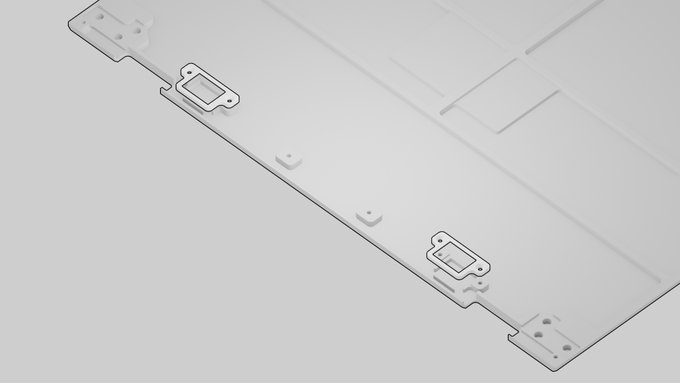

Reference: Mechanical
+++++++++++++++++++++

TODO sub-topics:

- Install a WiFi Card
- Install an SSD
- Exchange Batteries

The Case
========

The case consists of the following 5 parts. All parts except the bottom plate are milled from 6061 aluminum, sand blasted and anodized.

1. **Screen Back:** housing the display and upper half of hinges
2. **Screen Front:** housing speakers and providing display bezel
3. **Main Box:** to which all PCBs (printed circuit boards) are attached via M2 screws: The keyboard from the top and motherboard, trackball/trackpad, and battery boards from the bottom. The lower half of the hinges and the system controller OLED PCB are mounted from the top as well.
4. **Bezel:** a thin part that provides a bezel for the keyboard and the system controller OLED
5. **Bottom Plate:** the bottom lid that is either milled from clear acrylic or aluminum

For easy (dis)assembly, Reform uses only M2 screws with Phillips-head everywhere (with one exception: M4 on the hinges).

When closed, the case is held shut by 4 little neodymium bar magnets which are located in the front edge of the screen enclosure and in the front of the main box.

TODO: mention that hinges can be opened >180 degrees

Main Box
--------

The main box contains most of the electronics:

- Reform Motherboard, exposing ports through openings on the left
- Power switch/cable assembly, connecting to motherboard header J22
- LiFePo4 battery, connecting to motherboard header J33
- Reform Keyboard, connecting to motherboard header J12 (internal USB)
- Reform Trackball, connecting to motherboard header J9 (internal USB)

Keyboard Bezel
--------------

TODO: line art

The Keyboard Bezel is inserted into the main box to close it from the top.

Screen Back
-----------

TODO: line art

The display panel rests in this case part. The left and right hinges are mounted in the bottom left and right corners with M4x5 screws.

The stereo speakers are mounted below the display and secured with the speaker holders.

TODO: neodymium magnets in back or front part?

Screen Front
------------

TODO: line art

This part serves as a bezel for the display.

Bottom Plate
------------

TODO: line art

The bottom plate closes the main box from the bottom.
