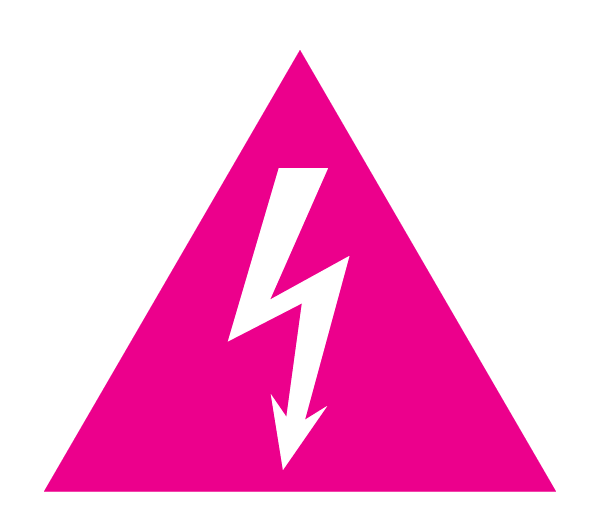
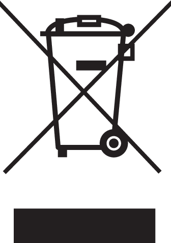

Safety & Environment
====================

Hazards
-------

Before you get started with your MNT Reform, please read these safety instructions carefully to prevent harm to yourself and your environment.

**Electrical Shock and Fire Hazard:** Please be extra careful while and after opening the case of the device. MNT Reform uses 8 batteries in series. When fully charged, these combine to a voltage of almost 29 volts, and the battery cells can easily deliver multiple amperes of current. Do not touch the metal pins of the battery holders with metal tools.

**Before servicing anything on the inside, make sure that the wall power is unplugged and remove all battery cells.**

**Damage to Hearing:** The headphone output of MNT Reform can be forced to extreme volume which may damage your hearing if you are not careful. Please make sure to set the volume to 30% or less before connecting headphones to MNT Reform, and then adjust the volume to a comfortable level.

Recycling
---------

Don't throw any MNT Reform parts in the trash! Batteries and electronics contain materials that are harmful to the environment if not properly disposed of.

You can mail any of the parts back to MNT Research, and we will recycle them for you. Alternatively, you can recycle batteries at a local battery collection facility and dispose of electronics and cables at a local e-waste facility.
